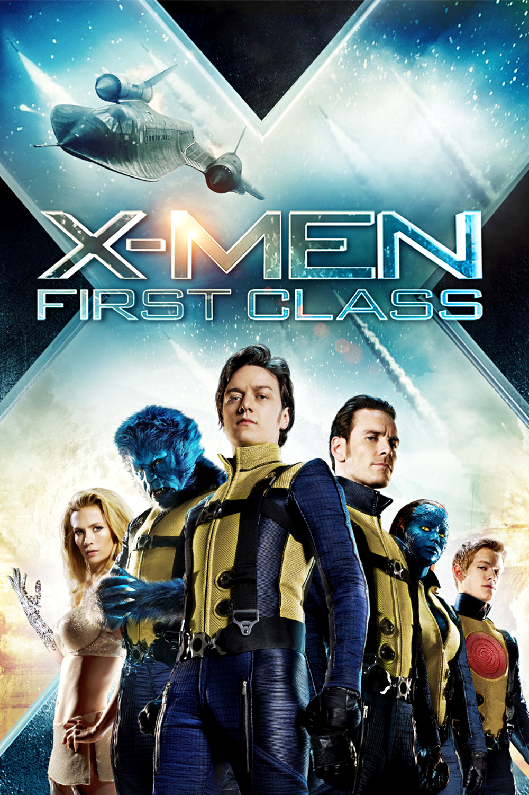
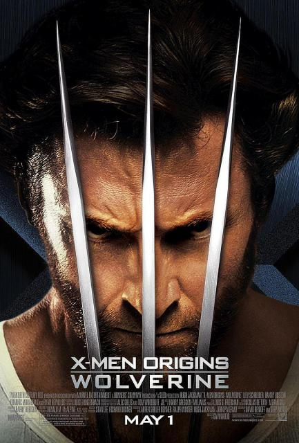
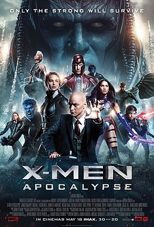

# X战警系列观影顺序

最近在撸 X战警系列的电影，从故事的时间线维度出发，整理现有影片的观影顺序

<!--more-->

---


gantt
    dateFormat YYYY
    axisFormat %Y
    title X战警系列电影，时间线

    section X-Men First Class
    Erik成长  : 1944,1962
    Erik复仇  : milestone,1962,1962

    section X-Men Origins Wolverine
    经历各种战争 : 1854,1975
    金刚狼复仇: milestone,1981,1981

    section X-Men Apocalypse
    干掉伪神 : milestone,1983,1983

    section X-Men
    与Erik对抗 : 2000,2003


## X-Men: First Class(2011)


时间：1944年
地点：奥斯维辛集中营
人物：万磁王小时候


万磁王（Erik）小时候在奥斯维辛集中营因愤怒等情绪展现出了控制铁制品的超能力，被纳粹Klaus Schmidt盯上了，一顿蹂躏，甚至还当着Erik面枪杀他的母亲

时间到了1962年，也是故事的大背景——古巴导弹危机。之前的纳粹Klaus Schmidt，因为具备吸收能量的超能力，老的没那么快，之后叫 Shaw（Sebastian Shaw）

Erik也各种展开复仇。

同时这部X战警也介绍了后续变种人中两大理念的领导者，Professor X（Charles） 和 Erik（“万磁王”）早期的爱恨情仇。以及“魔形女” Raven，Hank 四人之间的你侬我侬。

期间也闪现了Professor X（Charles） 和 Erik（“万磁王”）两人拉 James Howlett（即之后的“金刚狼”）入伙的镜头

**Mark** <u>这时候（1962年）越南战争还没结束。</u>

**第一战** 即是变种人和普通人类之间的第一战，也是Professor X（Charles） 和 Erik（“万磁王”）之间的第一战

## X-Men Origins: Wolverine (2009) / 金刚狼[^1]


时间：1854年
地点：加拿大
人物：金刚狼小时候


金刚狼（James Howlett）小时候一个不小心干掉了生父（Thomas Logan），之后和他的大兄弟（Victor Creed）狂奔，共同经历了美国内战，第一、二次世界大战，越南战争。


越南战争结束已是 **1975** 年，这期间已经过了121年，变种人的故事多多少少也会夹杂着同步发生


之后他俩加入了 **Stryker** 的变种人团队 ***X***

时间来到了 **6** 年后，那么至少是1981年之后了

感觉后面的矛盾基本都由 Stryker 挑起，金刚狼那钢铁般的爪子也是他给整出来的

这部最后还有些体现时间点的东西：

- Professor X（Charles） 已经坐上轮椅且头发没了

- 眼睛喷火的大哥（Scott）还小

- Deadpool 没完全GG



## X-Men: Days of Future Past ｜ 逆转未来（2014）

## X-Men: Apocalypse | 天启（2016）


时间：1983年
地点：美国俄亥俄州（OHIO）
人物：Scott


Scott 的课堂上，老师讲授着，变种人大规模出现在公众视野是在1973年的巴黎和平协约上 balabala

这集主要是讲如何干掉 传说中第一个变种人：En Sabah Nur

在此期间出现的人物，包括但不限于

* 风暴女（Ororo Moonroe，还没好好跟着 X-Professor）
* Caliban，收集情报
* 夜行者 Kurt Wagner
* Jean Grey

这里最牛逼的当属 Jean（琴），最后干掉那个伪神（En Sabah Nur）时并没有太多笔墨，感觉完全就是两个世界的人，直接降 n 维打击，了结了所谓的Boss。可谓是 Jean 才是大大大Boss啊。

这里有两个点🉑️ 先 「Mark」 

1. Jean 第一次与 金刚狼相遇，并帮他找到了名字 Logan。名字嘛，和“我是谁” 这种哲学性十足的问题简直不是个数量级的
2. X-Professor 的头发没了。挺难的：“第一站”之后难以直立行走，现在又头秃了，不是以前随意撩妹的帅教授了

最后关于时间点上来看还是有些瑕疵的，比如在“X-Men Origins: Wolverine” 的时候，Scott还是个孩子，那时至少是1981年之后，但这里已经是1983年了

不过本文并不是聚焦于此～

## X-Men（2000）

电影中似乎未提及具体时间，故事发生在1944年之后，not-too-distant future，但看着人物状态估计离X-Professor头秃的时候也有20年了，即2000年左右

X-Professor 和 万磁王（Erik）都老了，且之前X教授收的几个小弟（琴、暴风女、Scott）都具备一定的单兵作战能力

关于时间线方面，此时金刚狼还没找到当年实验基地的（An abandoned military installation in Canada）的记忆，即 X-Men Origins: Wolverine (2009) 讲述的故事。

## Reference

[^1]: https://rddiy.com/chuangyisheji/shijue/ygqje.html

<head> 
     
     
</head> 
<link rel="stylesheet" href="https://use.fontawesome.com/releases/v5.0.13/css/all.css">
