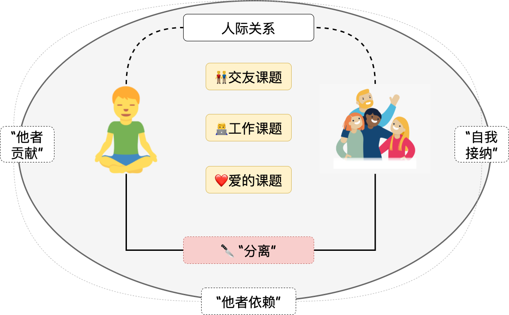

# 《被讨厌的勇气》

其实，你是为了大发雷霆而生气😠

<!--more-->

以一个简单且常见的例子展开说明

> 小明同学去餐馆用膳，结果紧张的服务员不小心把番茄酱洒在了小明新买的衣服。小明很生气，对服务员大发雷霆。

这波操作似乎还是符合剧情的，即 生气 $\Rightarrow$ 大发雷霆

但阿德勒心理学的态度是，因为小明要大发雷霆所以才生气，是“目的论”。

（「插播」 阿德勒、荣格、弗洛伊德 仨人所谓是心理学“三巨头”）

我们结合 📦箱子模型来看：外界刺激（“衣服被弄脏”）$\Rightarrow$ 小明这个整体 $\Rightarrow$ 行为（大发雷霆）。最后这个行为是小明自己选择的。其实最后选择什么是小明的自由，但就是需要对选择负责 o.o

我是被开篇这个观点吸引了，觉得很有意思。但也有不同的观点：认为是生硬的套上这一层目的。（不排除是我说的不富有感染力 😂）

借助这个例子是要想表达 我们应该**立足于目的论而不是弗洛伊德的原因论；不可以从过去中找原因；要否定精神创伤；人不是受过去原因支配的存在，人是为了达成某种目的而采取行动的**。

过去已然无法改变，我们需要专注于当下，做好此时此刻该做的事儿。过去和未来根本不存在，所以才要谈现在。起决定作用的既不是昨天也不是明天，而是“此时此刻”。

话又说回来，有时候在当下受挫或者受到些打击之类的很难专注于当下。但我们需要的是接受普通而又平庸的自己o.o “自我接纳”，而不是自我肯定，诚实的对待自己。正所谓，知之为知之，不知为不知，是知也。

我一直尝试用一句话来抽象概括全书😂 似乎是想营造一种“我理解了”的氛围。我还是诚实的对待自己吧😂

凭着自己的理解，还是有这么一张图👇

作为一个独立自由个体的我生活在这个世界上总会遇着你和他，即人际关系。这也带来了人生三大课题：👬交友、💻工作和❤️爱。而面对这三大课题，我们总会有烦恼、不开心的时候。为此，我们需要做的是“课题”分离，通过 **责任方**（“某种选择所带来的结果最终要由谁来承担？”） 确定这是谁的课题。此外，通过“自我接纳”、“他者信赖”、“他者贡献”建立起“共同体感觉”，以更好的解决人际关系的问题。

人的目标是追求幸福，开心快乐最为重要。正所谓重点不是说什么，而是做什么。经过独立、自由的个体选择后所产生的行动，肯定是有“爽点”的。或许是当下、或许是以后、或许...阿德勒心理学提倡、坚守的这些也是为了能增加自身的幸福感。

书中提到，

> 甚至也有人说要想真正理解阿德勒心理学直至改变生活方式，需要“相当于自身岁数一半的时间”。也就是说，如果40岁开始学的话，需要20年也就是到60岁才能学会。20岁开始学的话，加上10年，得到30岁才能学会。

修生养性的路子还长着呢～但在路上就是好的 🌞

<head> 
     
     
</head> 
<link rel="stylesheet" href="https://use.fontawesome.com/releases/v5.0.13/css/all.css">
