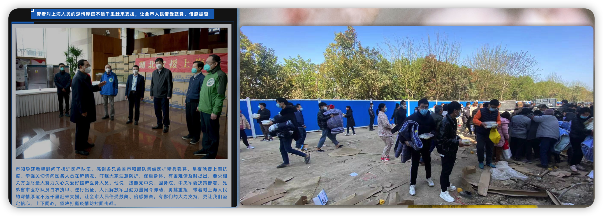

# 2022年3月上海新冠疫情流水账

2022年3月上海， 🦠[新冠](https://en.wikipedia.org/wiki/COVID-19)病毒迎来[“奥密克戎”](https://en.wikipedia.org/wiki/SARS-CoV-2_Omicron_variant)。我作为一个观察者记录客观结果/消息

<!--more-->

2019年年底、2020年年初的时候正逢硕士三年级的寒假，一直待在老家，吃喝主要由爸妈掌管，再加上十八线小县城不严重，3、4月份的时候就能出门活动了，但进入超市等聚集性场所时需要出示“健康码”，整体可以说是恢复了正常。那时候的我似乎也并没有觉得咋样，和以往假期差不多，就是时间长了许多。


gantt
    dateFormat YYYY-MM-DD HH
    title 2022年3月上海疫情个人流水账
    axisFormat  %Y-%m-%d

    封楼  : milestone,2022-03-13 19,  1h
    第1次核酸 : milestone,2022-03-14 02, 1h
    第2次核酸 : milestone,2022-03-14 15, 1h
    楼被封  : 2022-03-13 19,2022-03-16 16
    
    我司通知居家  : 2022-03-16 18,2022-03-18 23
    
    住处通知再核酸: milestone,2022-03-18 19,1h
    
    小区被封 : 2022-03-19 01,2022-04-30 22
    
    第3次核酸 : milestone,2022-03-19 10 ,1h
    第4次核酸 : milestone,2022-03-20 10 ,1h
    
    我司通知继续居家 : 2022-03-20 17 1h
    
    第5次核酸 : milestone, 2022-03-21 14,1h
    第6次核酸 : milestone, 2022-03-22 20,1h
    第7次核酸 : milestone, 2022-03-23 14,1h
    第8次核酸 : milestone, 2022-03-26 13,1h
    
    通知“划江而治” : milestone, 2022-03-27 20,1h
    
    第9次核酸 : milestone, 2022-03-28 15,1h
    
    第10次核酸 : milestone, 2022-03-30 10,1h
    
    第11次核酸，自测 : milestone, 2022-04-02 15,1h
    
    第12次核酸，自测 : milestone, 2022-04-03 10,1h
    
    全市再来一波 : milestone, 2022-04-03
    
    第13次核酸 : milestone, 2022-04-04 12,1h
    
    核酸或抗原 : milestone, 2022-04-06
    
    第14次核酸，自测 : milestone, 2022-04-06 14,1h
    
    第15次核酸，自测 : milestone, 2022-04-07 14,1h
    
    第16次核酸，自测 : milestone, 2022-04-08 14,1h
    
    第17次核酸，自测 : milestone, 2022-04-09 09,1h
    
    第18次核酸 : milestone, 2022-04-09 20,1h
    
    第19次核酸，自测 : milestone, 2022-04-11 10,1h
    
    发了10个抗原试剂 : milestone, 2022-04-11 20,1h
    
    第20次核酸，自测 : milestone, 2022-04-12 00,1h
    
    有阳 : milestone, 2022-04-13
    
    第21次核酸 : milestone, 2022-04-14 09,1h
    
    第22次核酸 : milestone, 2022-04-18 11,1h
    
    第23次核酸 : milestone, 2022-04-20 11,1h
    
    第24次核酸 : milestone, 2022-04-21 11,1h
    
    第25次核酸，自测 : milestone, 2022-04-23 11,1h
    
    第26次核酸，自测 : milestone, 2022-04-26 09,1h
    
    第27次核酸 : milestone, 2022-04-26 13,1h
    
    第28次核酸，自测 : milestone, 2022-04-27 09,1h
    
    第29次核酸 : milestone, 2022-04-27 15,1h


## 流水账

时间来到了**2022年3月13日 周日**，下午回到上海住处的时候看见楼下停着一辆MPV，有三个“大白”（对穿着防护服工作人员（主要是医务人员）的简称，类似下图）。我好奇问了问这栋楼是有什么事了么，其中一个工作人员告诉我，没什么事，例行检查。事后才知道楼道里有密接，居家隔离。到晚上7点的样子楼就被封了，只进不出，实行了“2+12”（2天封闭管理，期间两次核酸检测，若大家都是阴则放开，否则继续封）。这会儿上海浦东新区以及我住处周边还没大面积的封楼、封小区，外卖、快递还算是正常。

到了**3月16日 周三**，居委会的工作人员说解封了。我以为一切都将结束，准备收拾收拾第二天去公司上班了。哪知晚上公司发来消息说上海职场周四、周五居家办公。此时的我依然是乐观态度😂 也不知道哪来的信心。

紧接着**3月18日 周五晚上7点**街道居委又发来消息说明后天开展两次核酸检测，让准备物资。经历了上一次“2+12”的我想当然的以为，周末封两天、周一又正常上班了。8点一刻的样子，我准备出门买点吃的，以能度过周末。周四、周五那两天我依然沉迷于工作，没太在意这些事儿，本打算周五晚上去公司拿键盘等配件的也没去。哪知道这次是直接把小区封了😂

等到**3月20日 周日**的时候大家还是想着周一能正常去上班的，直到下午5点20分的时候，我司HRBP发来消息说，**自3月21日起上海职场继续居家办公，具体复工时间待定**。紧接着，7点40分的时候小区也通知明、后天继续核酸检测。这一波应该是[响应政府的号召](https://mp.weixin.qq.com/s/ZrUzGlDkigQLR_Gs3jP95A)

这时候配送人力就略显紧张了，外卖商家也少了，叮咚、盒马、每日优鲜、美团买菜等APP也是各种爆单，大家都开启了囤货模式，同时价格也不让涨。3月25日当天，“上海发布”公众号发三篇关于「价格」的事儿，政府严控价格。

资源是有限的，政府禁止了「价格」，那就要选择别的分配手段。私营企业这边主要是盒马等电商平台，平台方的分配机制不得而知，但作为老百姓的我直观感受是需要付出时间成本的，譬如盒马从一开始的晚上12点开始抢、到早上7点下单、再到模棱两可的说早8点30开放运力。以及下单时点大家蜂拥而至，一直不断重复戳着手机屏幕的“结算”button。政府便给配送物资的车辆发“通行证”以保障民生。谁能拿到通行证？通行证给谁？

这段时间一直就持续这样的状态：早上6点起来抢物资，大约到6.15基本大局已定；继续睡会，8点30分再来碰碰运气。之后再起来开启一天紧张的工作直到晚上10点。

**2022年3月28日 周一**，新一轮核酸检测，划江而“治”，期间经历了四次核酸检测：两次是医务人员检测，两次是抗原自检。这周好在跟上了一两个社区团购，买了些自热饭和面包。我分别在2022年3月31日和4月2日领到政府的物资，第一波是6根黄瓜、6根胡萝卜和2颗卷心菜；第二波是挂面、一袋火腿肠和一罐午餐肉

国务院副总理孙春兰来沪，于 **2022年4月4日** 全市再来一波核酸检测

**2022年4月6日**，[要求全市范围再进行一波检测](https://mp.weixin.qq.com/s/QXtV0k0vDYZQkPJ0W2XDDA)。简单理解为不咋严重的采用抗原检测

**2022年4月7日**，[全市范围再再进行一波](https://mp.weixin.qq.com/s/vU7zkW0SeoqizeU50JLg3g)

**2022年4月8日**，再再再开展

**2022年4月18日**，收到公司大礼包

**2022年4月20日**，所住小区收到政府的物资

（其实感觉挺有意思的，政府、公司就知道我需要这些东西？ 哈哈，有时候只是借着这些东西传递一些相应的“意思”罢了，但不见得就是经济的，毕竟这些东西我也难以加工，最终还是扔掉。怕就怕在最后有些不明事理之人从道德层面美名其曰浪费）

---

## 一些有意思的图

官媒 🆚 某地前线 2022-04-05

微博 `#上海买菜` 话题被封杀，2022-04-08

有点意思，**小区封了一个月**，突然有阳性，居委会说是已转运。2022-04-13
见识下，什么叫真正的 0⃣️

source: https://covid19.who.int/region/searo/country/kp

网上有个 “四月之声” 的视频，单纯的记录下

感觉现在的操作有点像，

<head> 
     
     
</head> 
<link rel="stylesheet" href="https://use.fontawesome.com/releases/v5.0.13/css/all.css">

