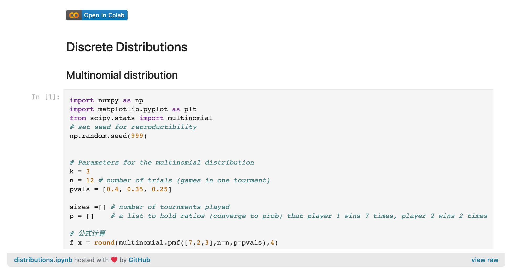
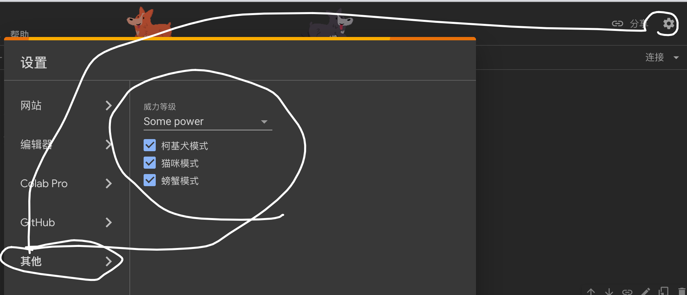
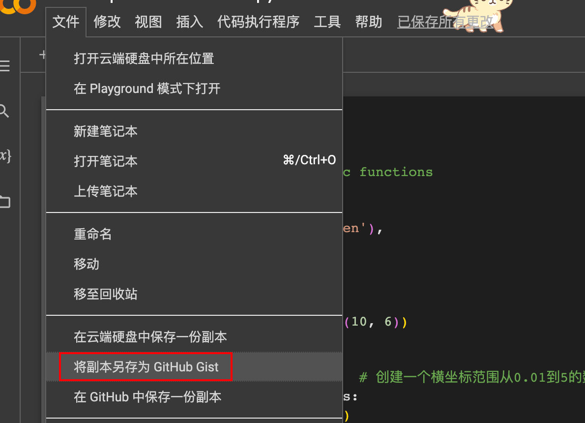
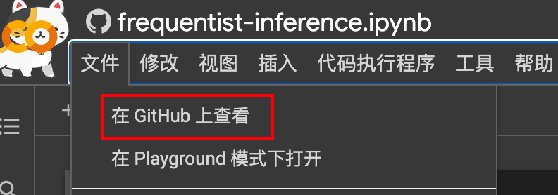

# 将google-colab的代码嵌入网站


RT，在网站中显示notebook Python代码

<!--more-->

类似这个 [review_of_distributions]()




之所以会有这个需求也是因为之前整理笔记的时候需要用Python画图，同时也想在post至网站时保存代码。一个比较直接的方案就是在本地运行成功后进一步在每张图下面加上code。虽然用于笔记的code有一定的临时性，但有个在线可运行跨平台的地方保存着也算是有个归宿了，同时以notebook的方式与笔记建立关联后，也保持着可复现性与一致性。

在线可运行代码且跨平台的地方便是Google的[colab](https://colab.research.google.com/)产品了，代码可保存至google云盘；剩下的就是将notebook嵌入至网站文章中了。这里采用的是GitHub的gist。整个流程便是



flowchart LR;
  A["colab管理代码"]
  B["gist"]
  C["嵌入文章"]
  A --> B --> C



## colab

别的不说，**colab可免费使用GPU** 这一点就很强了。基建性质的产品，还得是大厂

可以召唤些好玩的




## Github gist

如图所示，文件另存为 github gist




登录、关联GitHub 之后就会看到colab的notebook左上角有一个GitHub 的logo。这就表示成功了


## 嵌入网站文章

在刚才带有GitHub logo的页面，“文件” - “View on GitHub”




复制右上角的的代码，并嵌入文章中，like

```html
<p>
<script src="https://gist.github.com/unclehuzi/83aacb56ce8750b793a0619294fd183d.js"></script>
</p>

```


## References

1. https://pythonviz.com/colab-jupyter/google-colab-notebook-save-to-github-gist/


<head> 
    <script defer src="https://use.fontawesome.com/releases/v5.0.13/js/all.js"></script> 
    <script defer src="https://use.fontawesome.com/releases/v5.0.13/js/v4-shims.js"></script> 
</head> 
<link rel="stylesheet" href="https://use.fontawesome.com/releases/v5.0.13/css/all.css">
