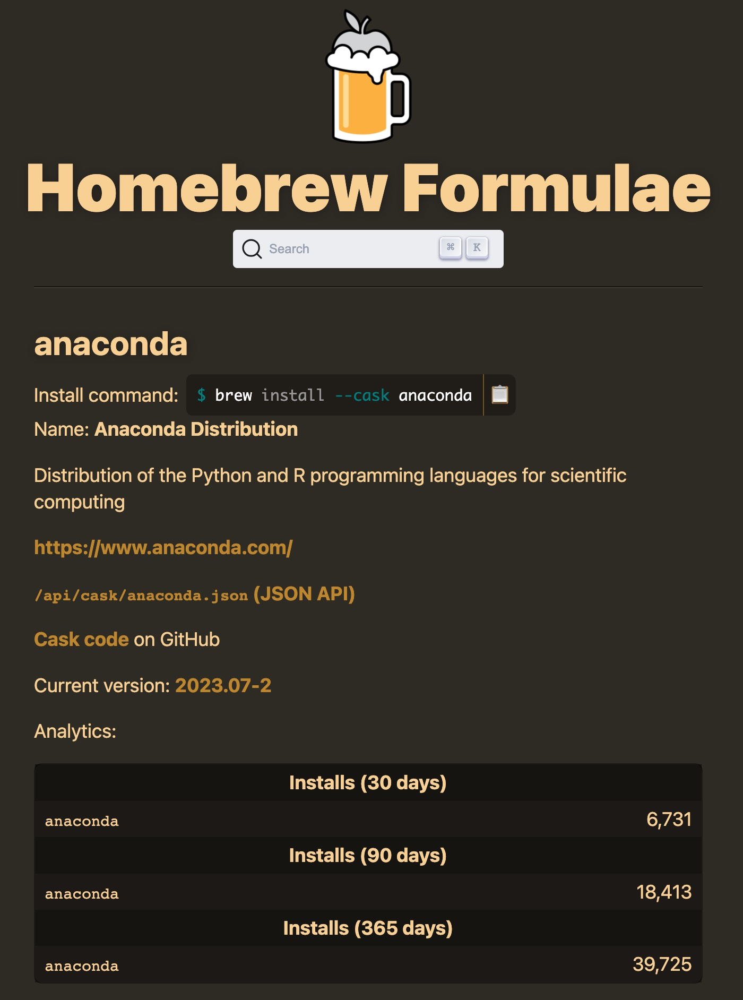

# macOS通过homebrew安装anaconda


RT，记录下安装流程，防止迷路


<!--more-->


最近电脑的Python环境总有些问题，之前刚好了解了[homebrew](https://brew.sh/)，就干脆把之前的Anaconda卸载了，重新用homebrew安装



flowchart LR;
  subgraph homebrew
    direction TB
        i2["安装homebrew"] -.-> f2[`brew install --cask anaconda`]
  end
  A["卸载Anaconda"]
  A --> homebrew --> B["配置环境"]



## 卸载Anaconda

anaconda的官方文档有详细的卸载过程：https://docs.anaconda.com/free/anaconda/install/uninstall/

1. 通过 `anaconda-clean` 卸载
2. 删文件夹、删文件
3. 删环境变量


## homebrew

### 安装homebrew

1. 解决网络的问题

   执行 “终端代理命令”，让终端也能突破限制 

   或者 走国内镜像

2. 安装homebrew


### homebrew安装anaconda

`brew install --cask anaconda`




## 配置环境

安装完后终端输入 `Python` 或 `conda list` 之类的命令是没有反应的，还需要配置下系统环境变量。Windows环境下通过UI界面安装时可直接勾选☑️

```shell
# if you're using bash
echo 'export PATH="/usr/local/anaconda3/bin:$PATH"' >> ~/.bash_profile

# if you're using zsh
echo 'export PATH="/usr/local/anaconda3/bin:$PATH"' >> ~/.zshrc
```


```shell
source ~/.bash_profile
conda init

# or... if you're using zsh
source ~/.zshrc
conda init zsh

# ！！！ conda init is available in conda versions 4.6.12 and later.
```


### 配置阿里镜像源

#### conda

修改 `.condarc` 文件

```
channels:
  - defaults
show_channel_urls: true
default_channels:
  - http://mirrors.aliyun.com/anaconda/pkgs/main
  - http://mirrors.aliyun.com/anaconda/pkgs/r
  - http://mirrors.aliyun.com/anaconda/pkgs/msys2
custom_channels:
  conda-forge: http://mirrors.aliyun.com/anaconda/cloud
  msys2: http://mirrors.aliyun.com/anaconda/cloud
  bioconda: http://mirrors.aliyun.com/anaconda/cloud
  menpo: http://mirrors.aliyun.com/anaconda/cloud
  pytorch: http://mirrors.aliyun.com/anaconda/cloud
  simpleitk: http://mirrors.aliyun.com/anaconda/cloud

```


#### pip

修改 `.pip/pip.conf` 文件

```
[global]
index-url = http://mirrors.aliyun.com/pypi/simple/

[install]
trusted-host=mirrors.aliyun.com
```


## References


1. [Uninstalling Anaconda Distribution](https://docs.anaconda.com/free/anaconda/install/uninstall/)
2. [Homebrew brew update 长时间没反应（或卡在 Updating Homebrew...） ](https://juejin.cn/post/6931190862295203848)
3. [Get your anaconda ready after brew install | inDev. Journal](https://frankindev.com/2018/01/27/get-anaconda-ready-with-brew/)
4. [阿里云Anaconda镜像](https://developer.aliyun.com/mirror/anaconda/)
5. [阿里云pip镜像](https://developer.aliyun.com/mirror/pypi?spm=a2c6h.13651102.0.0.27e11b11V4Ur7p)


<head> 
    <script defer src="https://use.fontawesome.com/releases/v5.0.13/js/all.js"></script> 
    <script defer src="https://use.fontawesome.com/releases/v5.0.13/js/v4-shims.js"></script> 
</head> 
<link rel="stylesheet" href="https://use.fontawesome.com/releases/v5.0.13/css/all.css">
