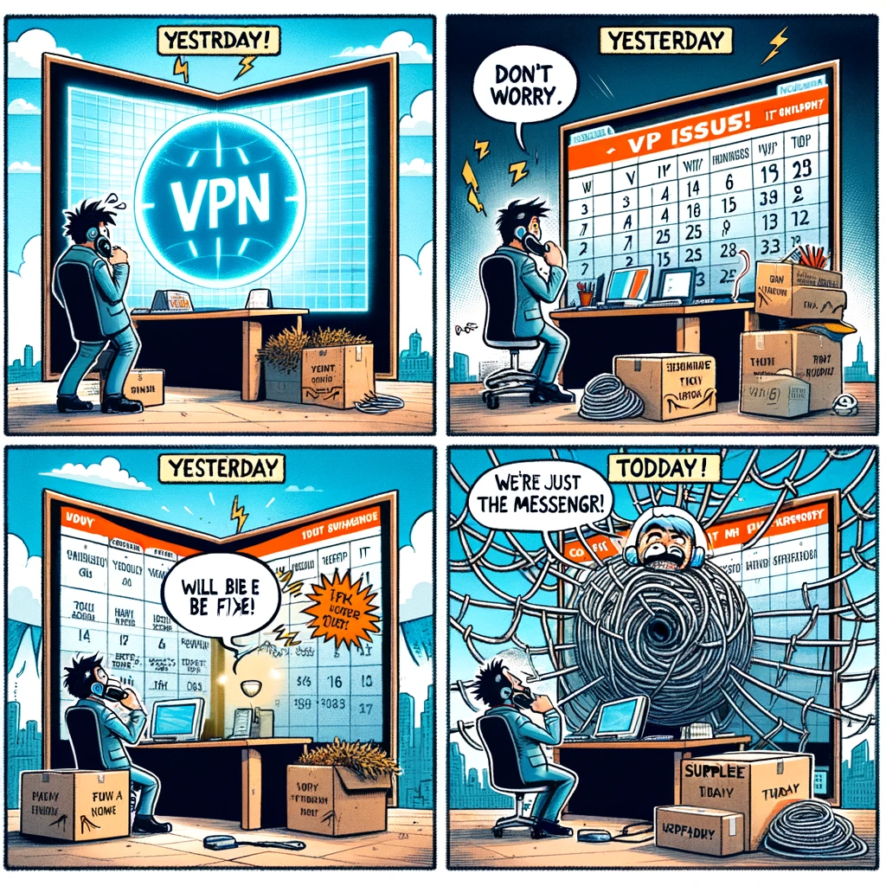
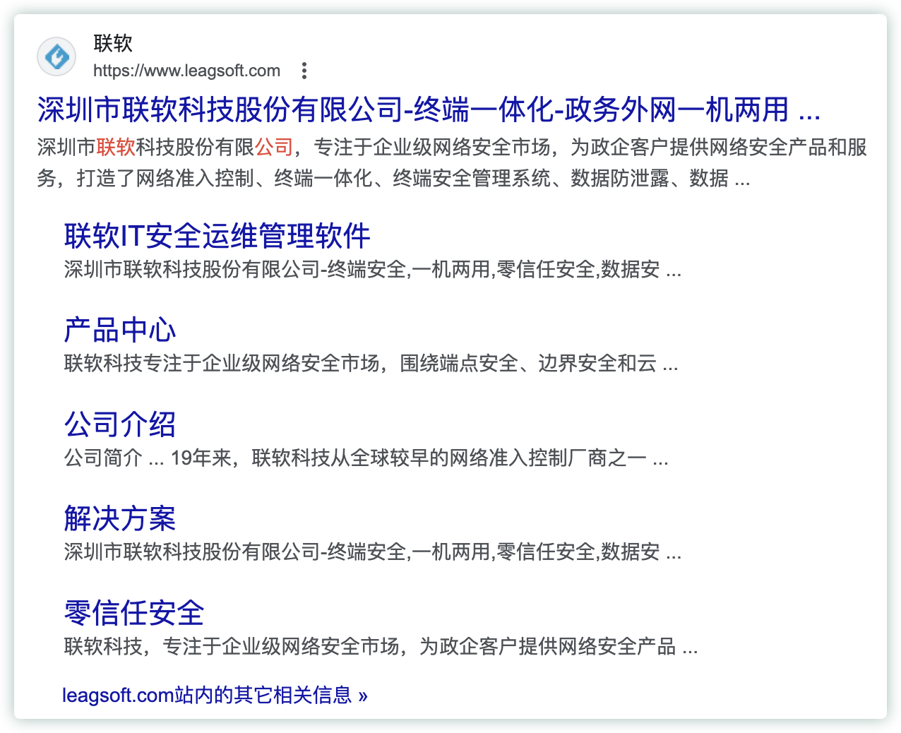

# 这一天天的碎碎念

跟踪下每天的碎碎念，是不是依然在原地踏步，什么时候能换换？？？

<!--more-->

## 202407

### 20240701

这是个有趣的跟踪，年后那一个月记录些事儿，之后长达3个月的时间里，就基本没咋更新了😂  真是个有趣的现象

今天是2024年下半年的第一天，是的呢，得是个好的开始才对呀。而我今天一早开始就很丧😂   不想上班的情绪拉到的极值，一度想辞职...周末又再一次梦见自己裸辞😂

又看到半年度绩效跟踪开始了，就是个笑话，论资排辈的草台班子。有种很强烈的感觉：在精力最旺盛的年纪，无所事事... 工作上也没什么盼头，也没什么🉑干的。就这样吧，关于这个绩效流程啥的，要是没人提，我就不写了😂 写了又能怎样呢？ 乐观点，对自己负责？对自己过去半年时间负责？（嗯  我觉得也不是不行噢）

之所以没实际落地裸辞，主要是还是在于机会成本吧，还有辞职之后做什么🤔  多看看新买的小沙弥，开心点😄

## 202403

### 20240326

搞了个数据治理啥的，从郑州过来，调研？也是挺搞笑😂  不知道说了个啥。没有啥逻辑

### 20240301

周五了。晚上看封面点开了一个电视剧😂

看到句台词，可真有意思：

> 公司死的鱼多了，但这个网永远都没破

## 202402

### 20240220

- 重新定义今天

> 前天说今天vpn能好；昨天也说今天vpn能好；今天又是一个新的今天 :)

真拉垮，说是家持牌金融机构，然后把网络安全的基建外包。然后2天过去了，还没搞定😂 重新定义今天

- 收集问题做做样子

入职后填了好几个团队发的什么问题收集问卷。刚开始的时候挺积极的，也希望能改善些。结果最后都不了了之，填个der  就TM做做样子，给老板交个作业。推的动？笑der

噢，还可以来个人告诉你现在的样子，教你现在的系统怎么用 （干得漂亮）

### 20240219

春节后开工第二天，工作环境让我很无语😓

- 公司发的电脑连不上公司的Wi-Fi

  为什么不找公司的IT？ 我觉得公司的IT是大爷。这种小事要找大爷么？

  打过几次交道，实在是无语，不然也不会抛弃公司发的所有办公设备。现在办公用的电脑、外接显示器全是自己的。真的呵呵，自费打工

- mac版 SDP 无法使用

  公司发的电脑连不上Wi-Fi这个事儿，我可能是个例。但 mac版类似VPN的东西用不了，是所有人都这样 真的是笑死

  这是个啥问题呢？谁来背锅呢？扣扣供应商的钱就完事儿了？会不会扣钱都是另一回事儿

  

- 信贷行业，还有哪家公司模型系统和引擎耦合是如此严重的？？？

  转正材料的建议里详细阐述了这个问题。并用公司楼下标准化流程的manner咖啡店形象比喻表达**耦合误事**。
  
  有一种风险叫操作风险。这边策略引擎应用个模型分，还需要策略人员额外配置？？？
  
  这是个重复劳动的重体力活：假设N个大规则集用到了同一个模型A，那就要配置N次。还没包括模型那边又改了哪个地方

  严重耦合不说，这一来一回的都是操作风险啊，笑der

  再展开下。。。

  系统、数据环境是难用的一批，相关利益方可能应该是做了优化，就觉得现在是最好的了。先不说有没有在市场上调研别家成熟的情况，交互逻辑本身就有问题😂

  提了建议也没啥卵用，来个人教你现在这个咋用，笑der  然后，我每次就都说，我当然会在现有的环境下寻求方案处理，但我想说的是那样更好😊

  更有意思的公司开大会，好像是科技的啥领导发言，说公司以科技优先啥的。我真的是笑der，就现在的系统、数据环境哪儿就上升到这个高度了，市场上那么成熟的，抄作业不行么，再不济，买一个好点的不行么？

### 20240216

百亿补贴，可能是个很好的洗钱路子！ 还能挂名“平台补贴”。 我不懂，可能这在洗钱里是低劣手法了 

---

=== buy me a coffe :) ===

--- 

<head> 
     
     
</head> 
<link rel="stylesheet" href="https://use.fontawesome.com/releases/v5.0.13/css/all.css">
