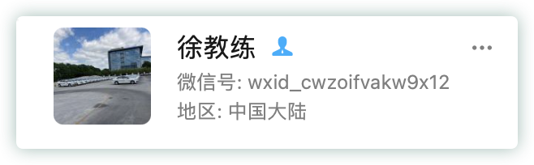

# 上海驾考报名费用记录

总算是持证了... 

<!--more-->
‍

实际接触到的是 **<u>教练</u>**，建议找熟人推荐，图中教练是飞哥羽毛球俱乐部的一个球友、也是校友推荐的

​​

‍

* 费用组成：<u>**教练费用 + ¥362**</u>

  * 教练 或 驾校

    * <u>学费</u>。这部分我单独给了教练，没接触驾校
    * 考试模拟费，这部分可以和教练谈好，打包在一起

      * 这部分是为了方便了解下真实的考场，**<u>主要是科目二</u>**
  * 车管所等单位要求的相关费用

    * 理论学习费用，¥12

      * 微信公众号：上海计时驾培服务平台
      * APP：长三角车生活
    * 体检费，正常 ¥120

      * 正常在医院体检是¥120：  ¥60（视力等常规检测）+¥60（拍照）

      * 特殊情况、特殊路子是另外的费用
    * 考试费：$¥40 \times 3= ¥ 120$
    * 驾驶证工本费：¥10

陌生领域，还是得找有经验的人咨询，所以记录在此

---

=== buy me a coffe :) ===

--- 

<head> 
     
     
</head> 
<link rel="stylesheet" href="https://use.fontawesome.com/releases/v5.0.13/css/all.css">
