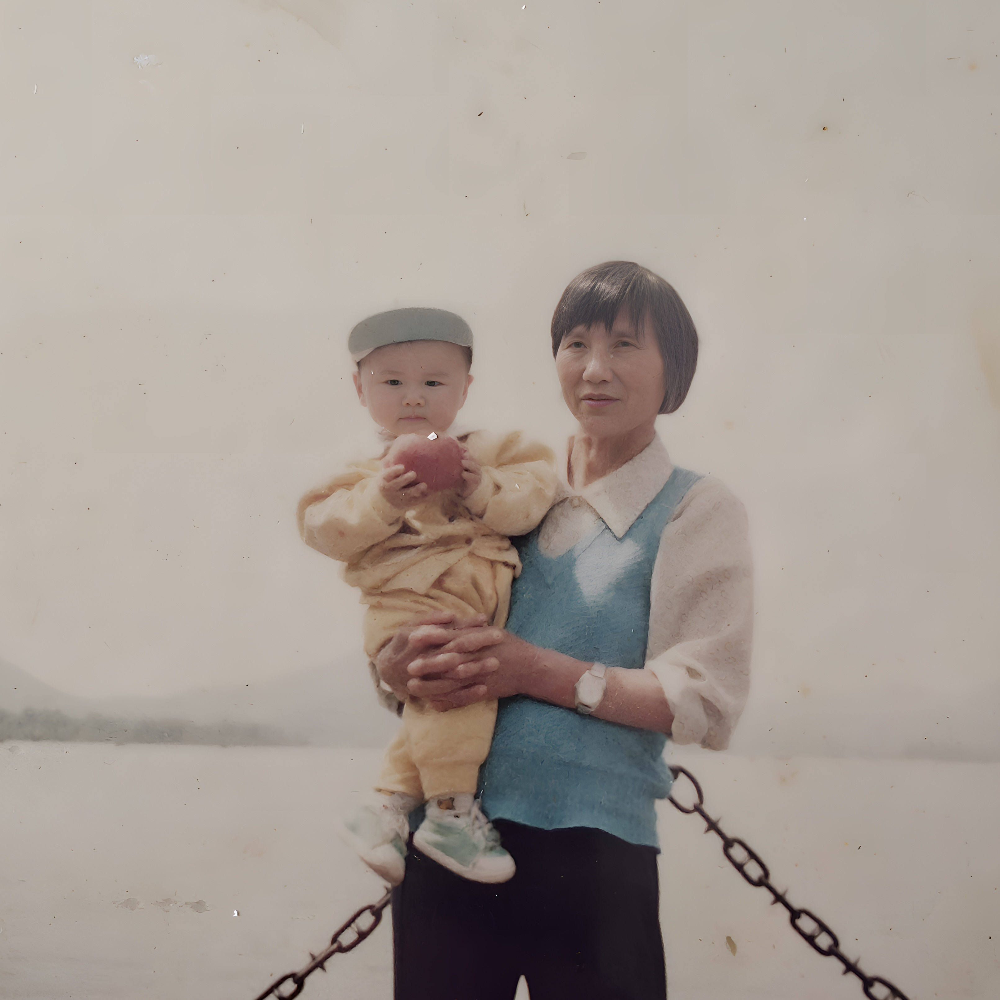

# 奶奶一动也不动了

**奶奶去了天堂**

<!--more-->



早在2周前就收到来自父亲的电话，从父亲的言语中大致能知道奶奶病危、命不久矣... 父辈的兄弟姐妹们在商量是否“拔管”

那天是周四（20241114），父亲说我还没回到老家，不能拔。于是奶奶继续待在了ICU

我一路向南，正如歌中所唱，似乎在期待着奶奶和我说，“你回家了，我在等你呢”

高铁上一直在单曲循环这首歌，是突然之间听懂了这首歌... 

看到歌曲的封面图，就立马想起来了小时候奶奶在（杭州）西湖旁抱着我

那是我第一次进ICU探望自己的亲人，我不知道该干嘛，也不敢呼唤奶奶，我怕她会激动...

最终，在周日（20241117）还是给奶奶拔了管，送她回到了老家的老房子里。在回去的路上，奶奶似乎很痛苦，我一直抓着她的手，途中奶奶也用她的指甲抠我，她的眼角也流出了泪水。她曾经在电话里和我说，奶奶要死了。她真的也害怕！

回到老家的房子后，又给奶奶打了强心针，下午逐渐恢复意识，她抓着我的手说，让我睡觉去。当然，她也说了好几遍，我也听了好几遍。因为真的说的不是很清楚了、也很小声

我能感受到，作为医生的父亲并不想她离开，同时也感受到父亲的无奈：作为医生，他可能觉得自己并没能延续奶奶的生命。心中万般痛苦

他依然想继续维持下去～ 继续给奶奶打针，以维持生命

回到上海后，电话里坚强的父亲也留下了泪水，诉说着过往...

拔管后差不多也就一周的时间，**2024年11月26日**，奶奶去了天堂，奶奶生平信仰耶稣，葬礼整体也比较简单，全程似乎没给大家流泪的场景。

关于葬礼，奶奶自己在生前就已经安排好了，主流程都跟随着耶稣教友们

当奶奶被送进火化室时，我流泪了... 奶奶在物理世界消失了... 🪦安息...  她辛苦了一辈子... 希望在天堂快乐... 开心... 

---

=== buy me a coffe :) ===

---

<head> 
     
     
</head> 
<link rel="stylesheet" href="https://use.fontawesome.com/releases/v5.0.13/css/all.css">
